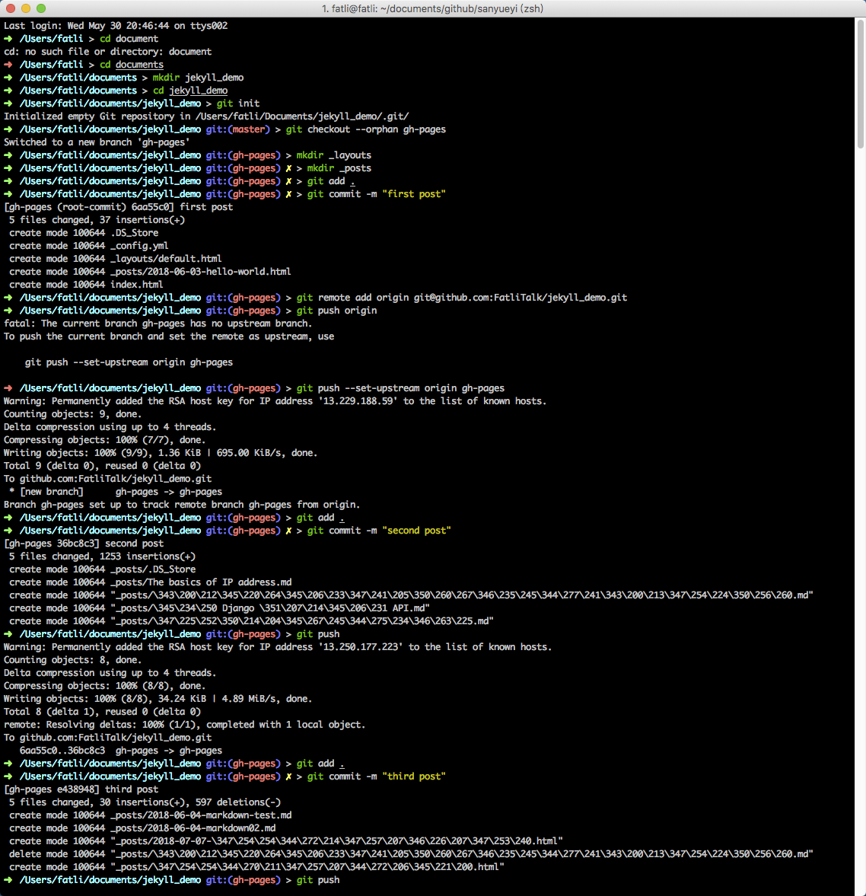

# jekyll_demo

初级教程： [搭建一个免费的，无限流量的Blog----github Pages和Jekyll入门](http://www.ruanyifeng.com/blog/2012/08/blogging_with_jekyll.html)

 

 

- `git checkout --orphan gh-pages` 表示创建一个新的（孤立）分支 gh-pages （默认分支为 master ），并 checkout 切换到 gh-pages 分支中
- `git remote add origin git@github.com:FatliTalk/jekyll_demo.git` 表示关联远程（remote）仓库。 Git 要求每个远程主机都必须指定一个主机名， `git remote`命令就用于管理**远程**主机名。克隆版本库的时候，所使用的**远程**主机自动被 Git 命名为 `origin`
- `git push origin` 等同于 `git push origin gh-pages` ，表示将本地的 gh-pages 分支推送到 origin 主机的 gh-pages 分支（远程分支）。语法为 `git push <远程主机名> <本地分支名>:<远程分支名>` ，如果省略远程分支名，则表示将本地分支推送与之存在"追踪关系"的远程分支（通常两者同名）；如果该远程分支不存在，则会被新建。

*更多请参考： [Git_6 远程仓库的使用（以 GitHub 为例）](https://github.com/FatliTalk/blog/issues/66) ； [阮一峰的网络日志：Git远程操作详解](http://www.ruanyifeng.com/blog/2014/06/git_remote.html)*
